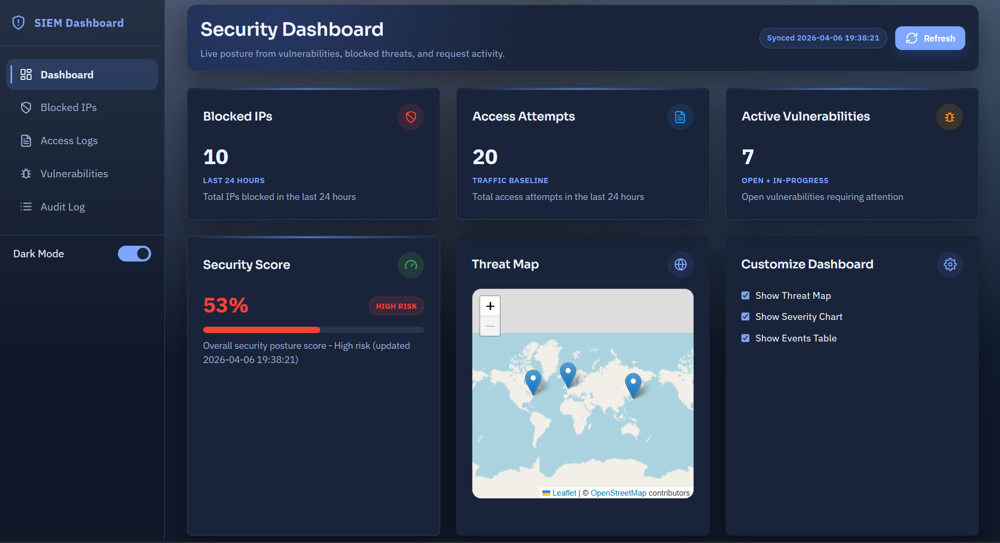
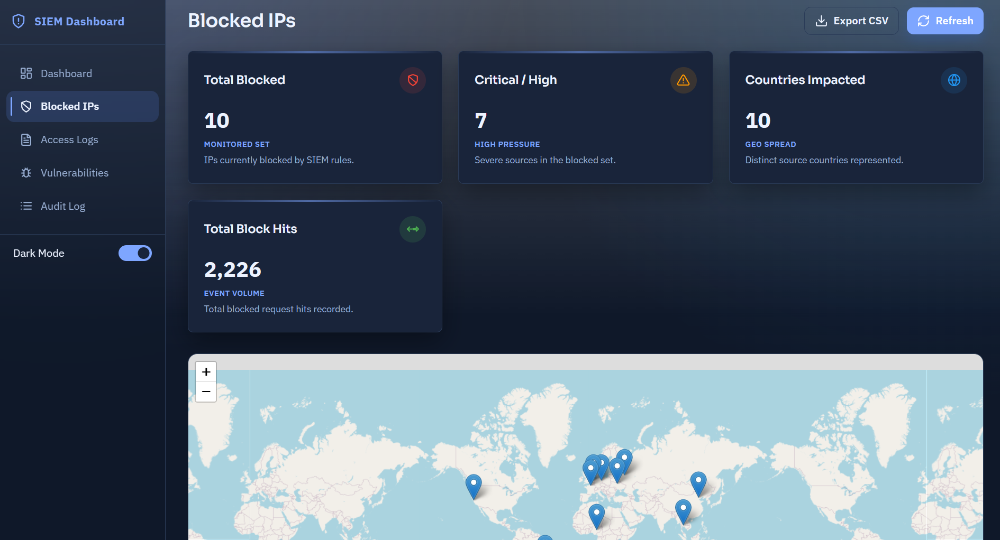
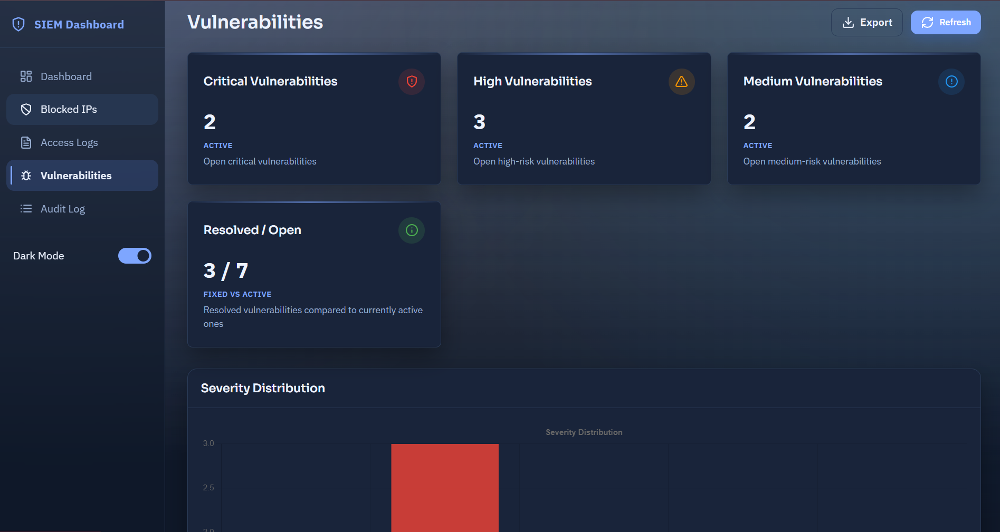

# SIEM-Dashboard 🔐📊

A full-stack Security Information and Event Management (SIEM) Dashboard built to monitor, visualize, and analyze system logs and security events in real time. Designed with modern UI and dark/light mode support, this project was developed as part of a cybersecurity internship to simulate a lightweight Splunk-like system.

---

## 👤 Author

- GitHub: [@hackernimit01](https://github.com/hackernimit01-dotcom)

---

## 🔧 Features

- 🌙 **Dark/Light Mode** — Seamless toggle between light and dark UI for better accessibility and UX.  
- 🌍 **Geo-IP Blocking** — Automatically blocks suspicious IPs based on geolocation data.  
- 🛡️ **Vulnerability Detection** — Detects potential system vulnerabilities using pattern matching and custom scripts.  
- 📈 **Access Log Visualization** — Displays real-time logs, source IPs, actions, and threat levels.  
- 📊 **Interactive Charts & Dashboard** — Graphs and tables powered by Chart.js for visual security analytics.  
- 🔐 **Secure Salt Authentication** — Login system protected using salted password hashing.

---

## 🧰 Tech Stack

| Layer           | Technology                      |
|----------------|----------------------------------|
| Frontend       | HTML, CSS, JavaScript, Chart.js  |
| Backend        | Python (Flask)                   |
| Visualization  | Chart.js, D3.js (optional)       |
| Database       | SQLite / MongoDB (configurable)  |
| Deployment     | GitHub Pages / Heroku / Localhost|

---

## 📂 Project Structure
```plaintext
├── static/ 
│ ├── css/ 
│ ├── js/ 
│ └── images/ 
├── templates/ 
│ ├── index.html 
│ ├── login.html 
│ └── dashboard.html 
├── scripts/ 
│ ├── vulnerability_scanner.py 
│ └── geo_blocker.py 
├── app.py 
├── config.py 
├── database.db 
└── requirements.txt 
```

---

## 🗒️ Install Dependencies

```bash
pip install -r requirements.txt
```

Windows one-click setup:

```powershell
.\install_webapp.bat
```

---

## 🌐 Run As Web App

### Local Development

```bash
python app.py
```

Open: `http://127.0.0.1:5000`

Windows one-click run (production-style local server):

```powershell
.\run_webapp.bat
```

PowerShell alternative:

```powershell
.\run_webapp.ps1
```

### Install On PC As Web App (PWA)

1. Start the app with `.\run_webapp.bat`.
2. Open `http://127.0.0.1:5000` in Chrome or Edge.
3. Click `Install App` in the sidebar (or browser menu: `Install SIEM Dashboard`).
4. The app will install as a standalone desktop app window.

### Production (Linux/macOS)

```bash
gunicorn -w 2 -b 0.0.0.0:5000 wsgi:application
```

### Production (Windows)

```bash
waitress-serve --host=0.0.0.0 --port=5000 wsgi:application
```

### Build And Run With Docker

```bash
docker build -t siem-dashboard .
docker run --name siem-dashboard-app -p 5000:5000 --env-file .env.example siem-dashboard
```

Open: `http://127.0.0.1:5000`

### Health Check

`GET /health` returns service status for deployment probes.

### Environment Variables

- `SECRET_KEY` - Flask session secret
- `DATABASE_URL` - SQLAlchemy database URL (default: `sqlite:///users.db`)
- `HOST` - bind host for `python app.py` (default: `0.0.0.0`)
- `PORT` - bind port for `python app.py` (default: `5000`)
- `FLASK_DEBUG` - set `1` for debug mode
- `DEFAULT_ADMIN_USERNAME` - initial admin username (default: `admin`)
- `DEFAULT_ADMIN_EMAIL` - initial admin email (default: `admin@example.com`)
- `DEFAULT_ADMIN_PASSWORD` - initial admin password (default: `password`)

---

## 📷 Screenshots

### Dashboard


### Blocked IPs


### Vulnerabilities


---
